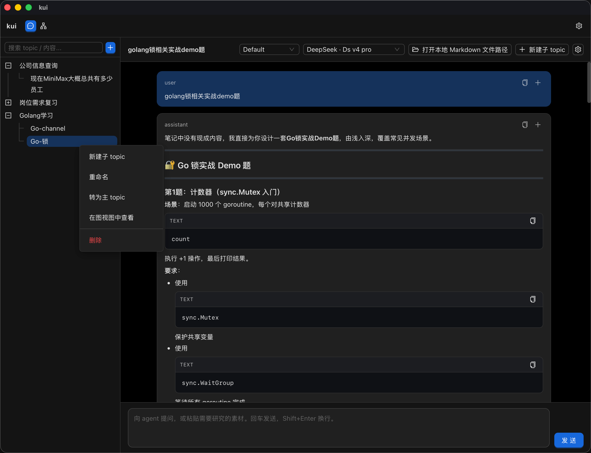
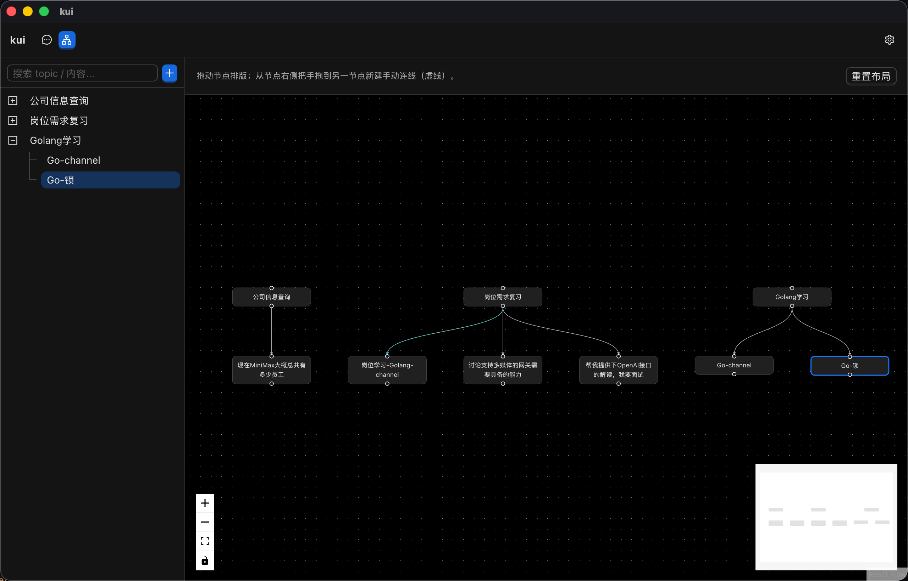

# KUI

[](LICENSE)
[](https://github.com/waterkokoro/KUI/releases)
[](https://github.com/waterkokoro/KUI/stargazers)
[](https://github.com/waterkokoro/KUI/network/members)
[](https://github.com/waterkokoro/KUI/issues)
[](https://github.com/waterkokoro/KUI/pulls)

> 💬 笔记式AI对话Client —— AI chat client like a notebook

---

## 📖 介绍

KUI 是一个笔记式的 AI 对话客户端，将 AI 对话与笔记功能有机结合，让你在交流的同时随时记录灵感、整理思路。

- 🚀 **轻量高效**：基于 Tauri + React + TypeScript 构建，低资源占用，流畅体验
- 📝 **笔记式对话**：对话记录自动存档，支持标签、搜索和分类整理
- 🤖 **AI 集成**：支持主流大模型 API，开箱即用
- 🌙 **暗色模式**：护眼舒适，全天候使用
- 🔧 **跨平台支持**：Windows、macOS、Linux 全平台覆盖

---

## 📸 预览

<p align="center">
  
  
</p>

---

## ✨ 功能特性

| 功能 | 说明 |
|------|------|
| 💬 多轮对话 | 支持上下文连贯的多轮 AI 对话 |
| 📔 笔记整合 | 对话内容自动保存为笔记，支持编辑和归档 |
| 🔍 智能搜索 | 快速检索历史对话和笔记内容 |
| 🎨 自定义主题 | 支持亮色/暗色主题切换 |
| 📤 导入导出 | 支持对话记录的导入和导出功能 |
| 🔌 扩展支持 | 预留插件接口，支持自定义功能扩展 |

---

## 🚀 快速开始

### 前置要求

- Node.js >= 18
- Rust (Tauri 后端依赖)
- 包管理器 (npm / yarn / pnpm)

### 安装与运行

```bash
# 克隆仓库
git clone https://github.com/waterkokoro/KUI.git
cd KUI

# 安装依赖
npm install

# 开发模式运行
npm run tauri dev

# 生产构建
npm run tauri build